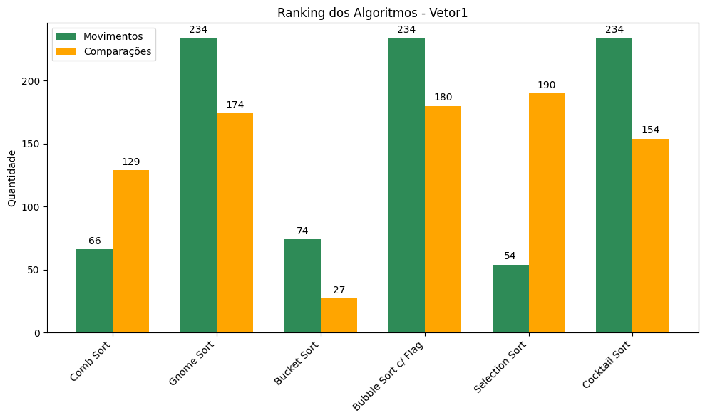

# Ordenacao

## Descrição
Este projeto Java propõe comparar o desempenho de diferentes algoritmos de ordenação. O sistema analisa métricas de desempenho como número de comparações e movimentações realizadas por cada algoritmo em diferentes cenários de dados, permitindo uma avaliação prática da eficiência de cada método.

## Instituição
**PUCPR - Pontifícia Universidade Católica do Paraná**

## Disciplina
**Resolução de Problemas Estruturados em Computação**

## Professor
**Andrey Cabral Meira**

## Alunos
- Erick Maestri de Souza (usuário: [ErickMS18](https://github.com/ErickMS18))

## Algoritmos Implementados
### 1. Comb Sort
Descrição: Evolução do Bubble Sort que utiliza um gap para comparar elementos distantes

Complexidade: O(n log n) na média, O(n²) no pior caso

Característica: Elimina eficientemente "tartarugas" (elementos pequenos no final)

### 2. Gnome Sort
Descrição: Similar ao Insertion Sort, usando passos para frente e para trás

Complexidade: O(n²) na média e pior caso, O(n) no melhor caso

Característica: Simples e eficiente para vetores quase ordenados

### 3. Bucket Sort
Descrição: Divide elementos em "baldes" e ordena cada balde separadamente

Complexidade: O(n + k) na média, O(n²) no pior caso

Característica: Excelente para dados uniformemente distribuídos

### 4. Bubble Sort com Flag
Descrição: Bubble Sort otimizado que para se nenhuma troca ocorrer

Complexidade: O(n²) na média e pior caso, O(n) no melhor caso

Característica: Adaptativo - muito eficiente em vetores quase ordenados

### 5. Selection Sort
Descrição: Seleciona repetidamente o menor elemento

Complexidade: O(n²) em todos os casos

Característica: Poucas movimentações, mas muitas comparações

### 6. Cocktail Sort
Descrição: Bubble Sort bidirecional que percorre o vetor em ambas as direções

Complexidade: O(n²) na média e pior caso, O(n) no melhor caso

Característica: Mais eficiente que Bubble Sort tradicional

## Cenários de Teste
Vetor 1: Dados aleatórios (caso médio)

Vetor 2: Dados ordenados crescentemente (melhor caso)

Vetor 3: Dados ordenados decrescentemente (pior caso)

## Análise de Resultados

